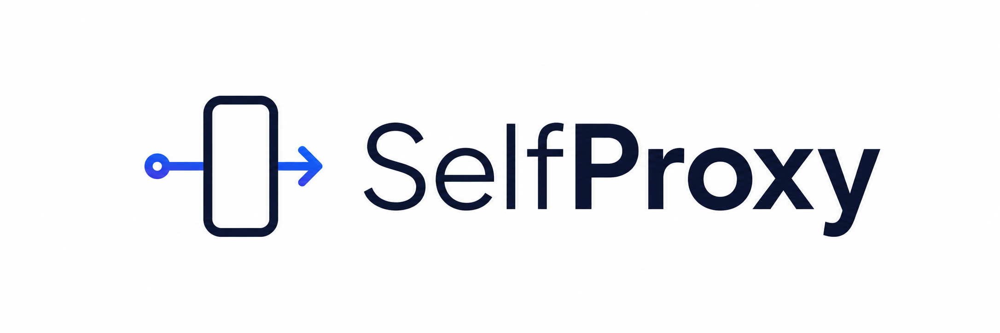

<p align="center">
  
</p>

<p align="center">
  <a href="LICENSE"></a>
  
  
  
</p>

<p align="center">
  <strong>Achar vaga é trabalho. oJobinho organiza o trabalho.</strong><br>
  Avalie oportunidades, adapte seu currículo e acompanhe candidaturas sem entregar seus dados a outro serviço.
</p>

## Comece em dois minutos

```bash
git clone https://github.com/Atroci/ojobinho.git
cd ojobinho
npm run init
```

Preencha `config/perfil.md` e `curriculo.md`. Depois abra Codex, Claude Code ou outro agente compatível com `AGENTS.md` e diga:

```text
Avalie esta vaga com oJobinho: https://empresa.com/vaga/123
```

| Quero... | Faça... |
|---|---|
| Encontrar vagas para testar | `npm run vagas` |
| Colocar uma vaga na fila | `npm run vaga -- "URL"` |
| Conferir configuração | `npm run doctor` |
| Rodar testes | `npm test` |

## Lista pública de oportunidades

A comunidade pode testar o fluxo usando a [lista de vagas remotas de Design, Branding e Social no Brasil e na América Latina](https://docs.google.com/spreadsheets/d/1lMBYP_qev6Q1bKcxW_cngyjuoKEqPz4PGyp0V2Vfu4M/edit?gid=2034983413#gid=2034983413), atualizada com apoio da UNEIA.

A planilha tem acesso de visualização. Você pode abrir a vaga original, copiar o link e adicionar ao seu pipeline. Para filtrar ou anotar, faça uma cópia para sua conta.

## O que oJobinho faz

- Avalia compatibilidade em uma rubrica A-G com nota de 1,0 a 5,0.
- Separa requisitos, salário, contrato, localização, interesse e legitimidade.
- Entende CLT, PJ, estágio, temporário e freelancer.
- Adapta currículo e mensagem sem inventar experiência.
- Mantém pipeline e tracker locais, em arquivos legíveis.
- Funciona dentro do agente de IA que você já usa.

## O que ele não faz

- Não envia candidatura, e-mail ou mensagem.
- Não clica em “Enviar” nem preenche portal sem você.
- Não guarda CPF, RG, senha, token ou dados bancários.
- Não contorna CAPTCHA, login ou bloqueio de plataforma.
- Não transforma falta de experiência em palavra-chave falsa.

Você escolhe a vaga, revisa os materiais e realiza a ação final.

## Fluxo

```text
vaga ou linha da planilha
        ↓
avaliação A-G + sinais de golpe
        ↓
decisão humana
        ↓
currículo + mensagem adaptados
        ↓
revisão e envio pelo candidato
        ↓
tracker local
```

## Feito para o mercado brasileiro

| Tema | Tratamento |
|---|---|
| Contrato | CLT, PJ, estágio, temporário e freelancer não são tratados como equivalentes |
| Remuneração | Mensal/anual, bruto/líquido, fixo/variável e benefícios ficam separados |
| Localização | Cidade, UF, remoto, híbrido, presencial e horário de Brasília entram na decisão |
| PJ | CNPJ ou MEI vira pergunta, nunca suposição |
| Segurança | Domínio, empresa, contato, pagamento antecipado e coleta precoce de documentos são verificados |
| Privacidade | Perfil, currículo e tracker ficam na sua máquina |

## Estrutura

```text
AGENTS.md                 regras para o agente
config/perfil.md          suas preferências, ignoradas pelo Git
curriculo.md              currículo mestre, ignorado pelo Git
data/pipeline.md          fila local de vagas
modes/avaliar.md          rubrica brasileira
modes/aplicar.md          preparação com revisão humana
tracker.csv               estado das candidaturas
reports/                  avaliações geradas
output/                   materiais adaptados
```

## Patrocinadores

Projetos que ajudam o oJobinho a chegar a mais brasileiros:

<table>
  <tr>
    <td align="center" width="50%">
      <a href="https://selfproxy.app">
        
      </a><br>
      <strong>SelfProxy</strong><br>
      Infraestrutura móvel com controle do próprio usuário.
    </td>
    <td align="center" width="50%">
      <a href="https://uneia.com.br/">
        
      </a><br>
      <strong>UNEIA</strong><br>
      Cursos gratuitos de IA, projetos para portfólio e comunidade de oportunidades.
    </td>
  </tr>
</table>

Patrocínio dá visibilidade e apoio ao projeto. Não altera nota de vaga, recomendação ou ordem de oportunidades.

## Contribua

Encontrou um portal brasileiro, risco de golpe ou diferença regional que falta? Abra uma issue com exemplo verificável. Não publique currículo, e-mail, telefone ou documento pessoal.

## Licença

MIT. Veja [LICENSE](LICENSE).
